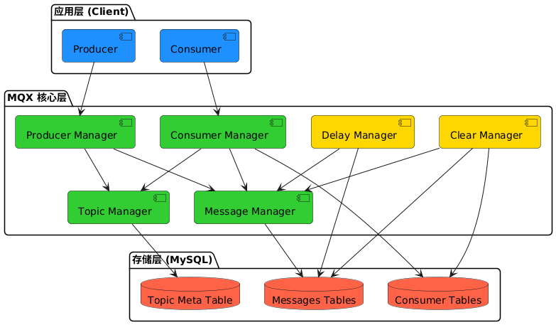

# MQX - 基于 MySQL 的轻量级消息队列

MQX 是一个基于 MySQL 的轻量级消息队列实现，以 Go 语言库的形式提供服务，无需额外部署消息服务器。

## 1. 项目介绍

### 项目背景
在中小型项目中，经常需要使用消息队列来解耦服务，但部署维护专门的消息中间件（如 RocketMQ、Kafka）会带来额外的运维成本。MQX 基于 MySQL 实现消息队列功能，复用现有的 MySQL 基础设施，降低系统复杂度。

### 核心特性
- 零部署：作为 Go 语言库集成，无需部署额外服务
- 消息可靠：基于 MySQL 事务保证消息可靠性
- 延时消息：支持指定延时时间的消息投递
- 虚拟分区：支持消息分区，提高并发能力
- 顺序消息：支持同一分区内的消息顺序消费
- 消费分组：支持消费者分组，同一条消息在组内消费一次

### 应用场景
- 系统解耦：降低系统组件间的耦合度
- 流量削峰：通过异步处理，平滑处理流量高峰
- 延时任务：实现定时任务、延时处理等场景
- 事件驱动：基于事件的业务流程处理
- 异步任务：异步发送邮件、短信等通知

## 2. 技术架构

### 整体架构



 ### 核心组件说明
 
 1. **Topic Manager**
   - 管理主题元数据
   - 负责主题的创建和分区管理
   - 维护主题配置信息
   - 创建和维护主题分区表
   - 管理主题的分区数量配置
   - 提供主题元数据查询服务
 
 2. **Message Manager**
   - 消息存储和检索的核心组件
   - 实现消息的分区存储
   - 管理消息生命周期
   - 按主题分区存储消息
   - 支持消息标签和键值索引
   - 实现消息批量读写操作
 
 3. **Consumer Manager**
   - 消费者组管理
   - 实现消费者负载均衡
   - 维护消费位点信息
   - 处理消费者心跳
   - 消费者注册和心跳维护
   - 消费组的分区再均衡
   - 消费位点管理和提交
   - 消费者实例生命周期管理
 
 4. **Producer Manager**
   - 消息发送管理
   - 实现消息路由策略
   - 处理同步/异步发送
   - 提供同步和异步发送接口
   - 实现消息分区路由
   - 支持延时消息转发
   - 保证消息可靠投递
 
 5. **Delay Manager**
   - 延时消息调度
   - 定时消息投递
   - 延时队列管理
   - 延时消息存储和调度
   - 定时扫描到期消息
   - 转发到期消息到目标主题
   - 保证延时精度和可靠性
 
 6. **Clear Manager**
   - 定期清理过期消息
   - 清理失效消费者实例
   - 维护系统存储空间
   - 保证数据表性能

 ### 数据模型
 
 1. **mqx_topic_metas 表**
   - 主题名称(topic)
   - 分区数量(partition_num)
 
 2. **mqx_messages_{topic}_{partition} 表**
   - 消息偏移量(offset)
   - 消息ID(message_id)
   - 消息标签(tag)
   - 消息键(key)
   - 消息体(body)
   - 生成时间(born_time)
  
 
 3. **Consumer 相关表**
   - mqx_consumer_offsets : 消费位点记录
   - mqx_consumer_instances : 消费者实例
   - mqx_delay_message : 延时消息


## 3. 快速开始

### 安装
```
go get github.com/github.com/wenzuojing/mqx

```

### 生产者示例

```golang
	cfg := mqx.NewConfig()
	cfg.DefaultPartitionNum = 16
	mq, err := mqx.NewMQX(cfg)
	if err != nil {
		panic(err)
	}
	for i := 0; i < 100; i++ {
		msg := mqx.NewMessage().WithTopic("test-topic").WithKey(fmt.Sprintf("%d", i)).WithBody([]byte(fmt.Sprintf("test message %d", i)))
		id, err := mq.SendSync(context.TODO(), msg)
		if err != nil {
			panic(err)
		}
		fmt.Printf("id: %s\n", id)
	}
```


### 消费者示例
```golang
	cfg := mqx.NewConfig()
	cfg.HeartbeatInterval = time.Second * 5
	cfg.DefaultPartitionNum = 16
	mq, err := mqx.NewMQX(cfg)
	if err != nil {
		panic(err)
	}
	mq.GroupSubscribe(context.TODO(), "test-topic", "test-group", func(msg *mqx.MessageView) error {
		fmt.Printf("topic: %s, group: %s, partition: %d, key: %s, body: %s\n", msg.Topic, msg.Group, msg.Partition, msg.Key, string(msg.Body))
		return nil
	})
```


## 3. 核心功能

### 普通消息
- 支持同步发送和异步发送
- 保证消息可靠投递
- 支持消息标签过滤

### 顺序消息
- 相同 key 的消息顺序投递
- 单分区内严格顺序消费
- 适用于订单、支付等场景

### 延时消息
- 支持指定延时时间
- 秒级延时精度
- 支持定时消息投递


## 4. 高级特性

### 消费者分组
- 支持多个消费组独立消费
- 组内消息只消费一次
- 支持广播消费模式

### 消息重试
- 消费失败自动重试
- 可配置重试次数和间隔
- 支持死信队列

### 并发消费
- 支持多消费者并行处理
- 自动负载均衡
- 消费者动态扩缩容


## 5. 配置说明

### 配置项说明

| 配置项 | 说明 | 默认值 | 单位 |
|--------|------|--------|------|
| DSN | 数据库连接字符串 | root:root@tcp(127.0.0.1:3306)/mqx | - |
| DefaultPartitionNum | 默认分区数量 | 8 | 个 |
| RetentionTime | 消息保留时间 | 168 (7天) | 小时 |
| RebalanceInterval | 消费者重平衡间隔 | 30 | 秒 |
| RefreshConsumerPartitionsInterval | 刷新消费者分区间隔 | 30 | 秒 |
| HeartbeatInterval | 消费者心跳间隔 | 30 | 秒 |
| DelayInterval | 延时消息处理间隔 | 5 | 秒 |
| PullingInterval | 消息拉取间隔 | 2 | 秒 |
| PullingSize | 单次拉取消息数量 | 100 | 条 |
| RetryInterval | 失败重试间隔 | 3 | 秒 |
| RetryTimes | 最大重试次数 | 3 | 次 |

#### 配置方法示例

```golang
cfg := mqx.NewConfig()
cfg.DSN = "root:root@tcp(127.0.0.1:3306)/mqx"
```


### 数据库配置

## 6. 性能优化

### 最佳实践
1. 合理设置批量处理大小
2. 适当配置数据库连接池
3. 定期清理已消费消息
4. 避免消息体过大

### 参数调优
1. 消费批次大小：建议 100-1000
2. 拉取间隔：建议 100ms-1000ms
3. 数据库连接池：根据并发量调整

### 注意事项
1. 避免消息积压
2. 合理设置消费超时
3. 注意消息幂等处理
4. 监控消息处理延迟

## 7. 常见问题

### 问题排查
1. 消息丢失：检查事务日志
2. 消费延迟：检查消费者状态
3. 重复消费：实现幂等处理

### 使用建议
1. 生产环境建议使用主从架构
2. 定期备份消息数据
3. 监控消息队列状态
4. 合理设置消息过期时间

## 8. 贡献指南

### 如何贡献
1. Fork 项目
2. 创建特性分支
3. 提交变更
4. 发起 Pull Request

### 开发规范
1. 遵循 Go 编码规范
2. 添加单元测试
3. 更新文档说明
4. 编写变更日志

## 9. 许可证

本项目采用 MIT 许可证，详见 [LICENSE](LICENSE) 文件。
